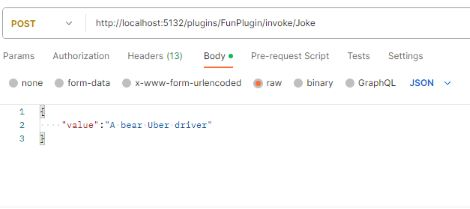

# sk-web-app
Semantic Kernel using minimal API

The Sematic Kernel is a great tool to help developers quickly integrate their codebases with OpenAI or Azure OpenAI models.  The SK team has provided wonderful samples in C# and python using functions, web apps and notebooks.  

[Semantic Kernel Overview](https://learn.microsoft.com/en-us/semantic-kernel/overview/)   
[Semantic Kernel Repo](https://github.com/microsoft/semantic-kernel)


The goal of this repository is to implement a C# minimal API using the Semantic Kernel SDK. 

## Getting Started

### Prerequisites
  
* An [OpenAI account](https://openai.com/)  
[Video on how to open an account](https://www.youtube.com/watch?v=zJSYMWlCcPY)
* API key from the [OpenAI portal](https://platform.openai.com/)     
OR
* An [Azure subscription](https://azure.microsoft.com/free/)
* Azure OpenAI subscription.  Access to the Azure OpenAI portal is by application only.  
Apply for access with this [form](https://aka.ms/oai/access?azure-portal=true)  
* Deployed model to reference in [Azure OpenAI Studio](https://learn.microsoft.com/en-us/azure/cognitive-services/openai/how-to/create-resource?pivots=web-portal#deploy-a-model)   
* Postman or other application to call endpoints.

## Usage

Clone this repository to your local machine.

Open the solution in your developer environment ([Visual Studio Code](https://code.visualstudio.com/), Visual Studio, etc.).

With a minimal API, the POST endpoint is simply defined in the program.cs file.
```C#
    app.MapPost("plugins/{pluginName}/invoke/{functionName}", async (HttpContext context, Query query, string pluginName, string functionName) =>
```   
The path specifies a "pluginName" and a "functionName" to execute.   
As an example, a call to this endpoint would be "/plugins/FunPlugin/invoke/Joke".  In the project FunPlugin is the directory which contains the Joke plugin.   

So... what are plugins?   
Plugins are interoperable, [Open AI standards based](https://platform.openai.com/docs/plugins/getting-started/), encapsulated AI capabilities.

Clear?   

How about, a plugin is a simple implementation of an AI task that can be shared in the future with other copilots.   
Within the Semantic Kernel repo are several examples of [plugins](https://github.com/microsoft/semantic-kernel/tree/main/samples/skills) (note: plugins used to be skills).   

Here is an example of the Joke plugin from this repo.
```Text
    WRITE EXACTLY ONE JOKE or HUMOROUS STORY ABOUT THE TOPIC BELOW

    JOKE MUST BE:
    - G RATED
    - WORKPLACE/FAMILY SAFE
    NO SEXISM, RACISM OR OTHER BIAS/BIGOTRY

    BE CREATIVE AND FUNNY. I WANT TO LAUGH.

    +++++

    {{$input}}
    +++++
```

The skprompt.txt file a simple text file defining the natural language prompt that will be sent to the AI service.   Pair that with the config.json file which provides configuration information to the [planner](https://learn.microsoft.com/en-us/semantic-kernel/ai-orchestration/planner?tabs=Csharp) and you have created a [semantic function](https://learn.microsoft.com/en-us/semantic-kernel/ai-orchestration/semantic-functions?tabs=Csharp).   

The next step is to read the header values passed in the request.  These are the Azure OpenAI or OpenAI information needed to execute the query.  Below is an example with Azure OpenAI
```C#
    var headers = context.Request.Headers;
    var model = headers["x-sk-web-app-model"];
    var endpoint = headers["x-sk-web-app-endpoint"];
    var key = headers["x-sk-web-app-key"];
    if (String.IsNullOrEmpty(model) || String.IsNullOrEmpty(endpoint) || String.IsNullOrEmpty(key))
    {
        throw new Exception("Missing required headers");
    }
```   
Instantiate the kernel 
```C#
    var kernel =  new KernelBuilder()
        .WithAzureTextCompletionService(model!, endpoint!, key!)
        .Build();
```   

Set the location and specified skill to execute   
```C#

    var pluginDirectory = "Plugins";

    var plugInFunctions = kernel!.ImportSemanticSkillFromDirectory(pluginDirectory, pluginName);
```   

Execute the function and return the result
```C#

    var result = await plugInFunctions[functionName].InvokeAsync(query.Value);
    SKResponse response = new SKResponse();
    response.Value = result.Result.Trim();
    return Results.Json(response);
```   
Start the application (Start or "dotnet run" from the terminal) and the service should be ready.   

From Postman, ask the service for a joke   
   

And the result...   
```JSON
    {
        "value":"A bear was looking for a job and decided to become an Uber driver. He was a great driver and always got five-star reviews from his passengers. One day, a passenger asked him why he was so good at his job. The bear replied, \"It's simple, I just follow the bear necessities of life!\""
    }
```


